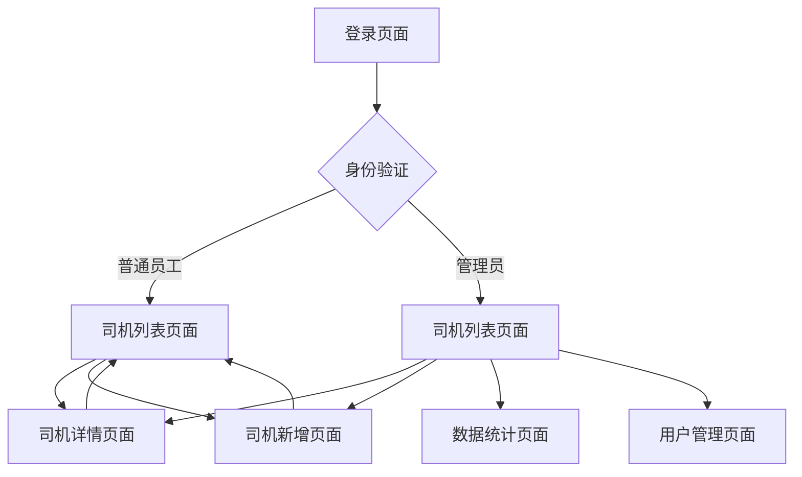

## 1. 产品概述
司机统计系统是货代公司的内部管理系统，用于员工管理接触的司机资源。系统解决司机信息分散、难以统计和权限管理混乱的问题，帮助公司统一管理司机资源，提高工作效率。

目标用户为货代公司员工和管理员，通过系统化的司机信息管理，提升业务协作效率。

## 2. 核心功能

### 2.1 用户角色
| 角色 | 注册方式 | 核心权限 |
|------|----------|----------|
| 普通员工 | 管理员创建账号 | 管理自己接触的司机信息，查看统计 |
| 管理员 | 系统初始化创建 | 管理所有司机信息，用户管理，数据统计 |

### 2.2 功能模块
系统包含以下主要页面：
1. **登录页面**：用户身份验证
2. **司机列表页面**：司机信息展示、搜索筛选
3. **司机详情页面**：司机详细信息展示和编辑
4. **司机新增页面**：添加新司机信息
5. **数据统计页面**：司机数据统计分析
6. **用户管理页面**：用户账号管理（管理员）

### 2.3 页面详情
| 页面名称 | 模块名称 | 功能描述 |
|----------|----------|----------|
| 登录页面 | 身份验证 | 输入用户名密码进行系统登录 |
| 司机列表页面 | 搜索筛选 | 按姓名、线路、联系方式等字段搜索司机，支持模糊查询 |
| 司机列表页面 | 列表展示 | 展示司机基本信息卡片，包含姓名、主要线路、联系方式、负责员工 |
| 司机列表页面 | 权限控制 | 员工仅查看自己负责的司机，管理员查看全部 |
| 司机详情页面 | 信息展示 | 展示司机完整信息：基本信息、主要线路、价格信息、备注等 |
| 司机详情页面 | 信息编辑 | 编辑司机各项信息，支持图片上传 |
| 司机详情页面 | 操作记录 | 显示司机信息的修改历史 |
| 司机新增页面 | 表单填写 | 填写司机基本信息、线路信息、价格信息等 |
| 司机新增页面 | 图片上传 | 上传司机相关证件照片 |
| 数据统计页面 | 概览统计 | 显示司机总数、活跃司机数、新增司机趋势 |
| 数据统计页面 | 员工统计 | 按员工统计负责的司机数量 |
| 数据统计页面 | 线路统计 | 按主要线路统计司机分布 |
| 用户管理页面 | 用户列表 | 展示系统用户列表和状态 |
| 用户管理页面 | 用户操作 | 添加用户、重置密码、启用禁用账号 |

## 3. 核心流程

### 普通员工流程
1. 登录系统
2. 查看自己负责的司机列表
3. 搜索和筛选司机
4. 查看司机详情
5. 编辑司机信息
6. 新增司机信息

### 管理员流程
1. 登录系统
2. 查看所有司机列表
3. 管理司机信息
4. 查看数据统计
5. 管理用户账号

## 4. 用户界面设计

### 4.1 设计风格
- **主色调**：蓝色系（#1890ff）为主，体现专业和可信赖
- **辅助色**：灰色系（#f5f5f5、#e8e8e8）用于背景和边框
- **按钮样式**：圆角矩形，主要操作使用主色调
- **字体**：系统默认字体，标题16px，正文14px
- **布局风格**：卡片式布局，左侧导航，右侧内容区域
- **图标风格**：使用简洁的线性图标

### 4.2 页面设计概述
| 页面名称 | 模块名称 | UI元素 |
|----------|----------|----------|
| 登录页面 | 登录表单 | 居中卡片布局，蓝色主题，包含用户名密码输入框和登录按钮 |
| 司机列表页面 | 搜索区域 | 顶部搜索栏，包含多个筛选条件，支持组合查询 |
| 司机列表页面 | 司机卡片 | 网格布局展示司机卡片，每张卡片显示头像、姓名、线路、联系方式 |
| 司机详情页面 | 信息展示 | 分区域展示基本信息、线路信息、价格信息，使用表格和列表形式 |
| 司机新增页面 | 表单区域 | 分步骤表单，包含必填验证，支持图片预览 |
| 数据统计页面 | 图表展示 | 使用柱状图、饼图展示统计数据，支持数据导出 |
| 用户管理页面 | 用户表格 | 表格形式展示用户信息，支持批量操作 |

### 4.3 响应式设计
- 桌面端优先设计，支持1280px以上分辨率
- 平板端适配，优化触摸操作体验
- 移动端支持主要查看功能，简化操作流程