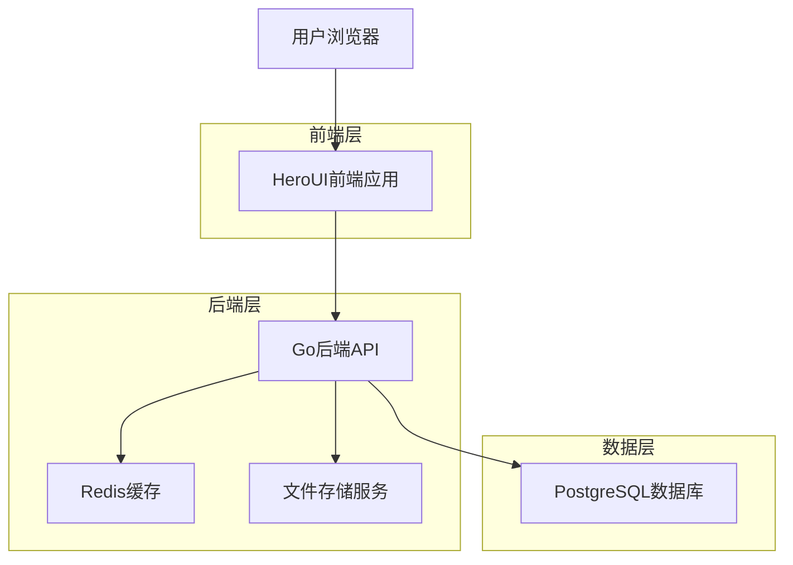
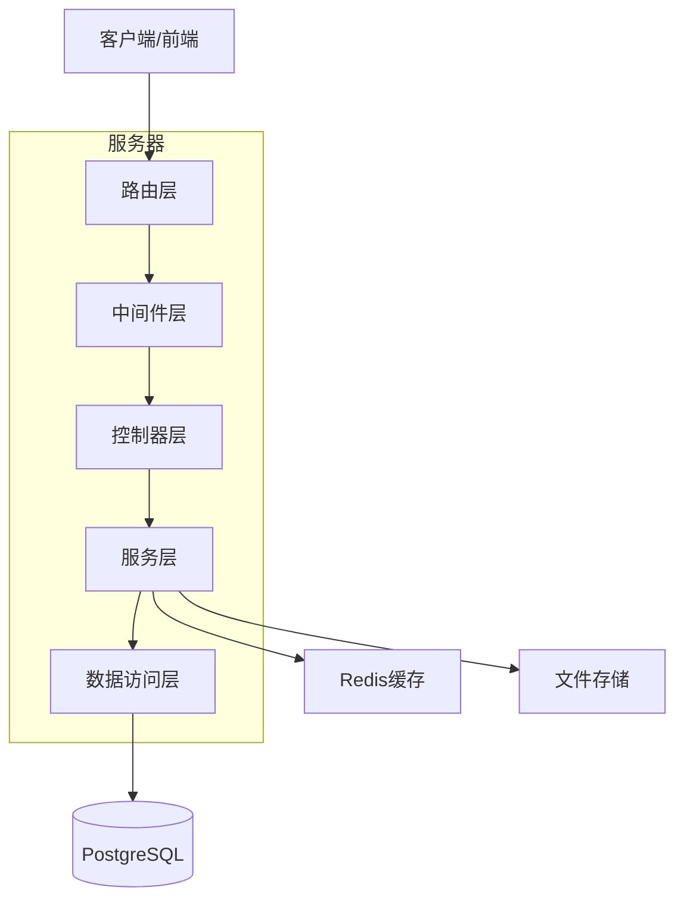
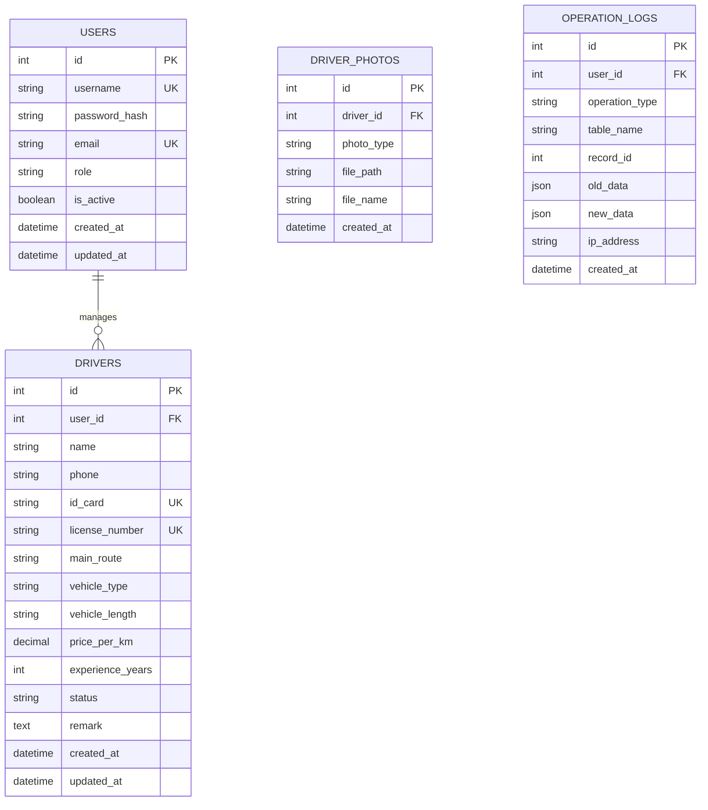

## 1. 架构设计



## 2. 技术描述

* **前端**: HeroUI + React\@18 + TypeScript + Vite

* **后端**: Go\@1.21 + Gin框架 + GORM

* **数据库**: PostgreSQL\@14

* **缓存**: Redis\@7

* **文件存储**: 本地文件系统/阿里云OSS

* **认证**: JWT + bcrypt密码加密

* **API文档**: Swagger/OpenAPI 3.0

## 3. 路由定义

| 路由           | 用途               |
| ------------ | ---------------- |
| /login       | 登录页面，用户身份验证      |
| /drivers     | 司机列表页面，展示和搜索司机   |
| /drivers/:id | 司机详情页面，查看和编辑司机信息 |
| /drivers/new | 新增司机页面，添加新司机     |
| /statistics  | 数据统计页面，展示各项统计数据  |
| /users       | 用户管理页面，管理员管理用户账号 |
| /profile     | 个人资料页面，查看和修改个人信息 |

## 4. API定义

### 4.1 认证相关API

#### 用户登录

```
POST /api/auth/login
```

请求:

| 参数名      | 参数类型   | 是否必需 | 描述     |
| -------- | ------ | ---- | ------ |
| username | string | 是    | 用户名    |
| password | string | 是    | 密码（明文） |

响应:

| 参数名         | 参数类型   | 描述      |
| ----------- | ------ | ------- |
| token       | string | JWT令牌   |
| user        | object | 用户信息    |
| expires\_in | number | 过期时间（秒） |

示例:

```json
{
  "username": "zhangsan",
  "password": "123456"
}
```

#### 获取当前用户信息

```
GET /api/auth/me
```

响应:

| 参数名         | 参数类型   | 描述   |
| ----------- | ------ | ---- |
| id          | number | 用户ID |
| username    | string | 用户名  |
| role        | string | 用户角色 |
| created\_at | string | 创建时间 |

### 4.2 司机管理API

#### 获取司机列表

```
GET /api/drivers
```

查询参数:

| 参数名        | 参数类型   | 是否必需 | 描述            |
| ---------- | ------ | ---- | ------------- |
| page       | number | 否    | 页码，默认1        |
| page\_size | number | 否    | 每页条数，默认20     |
| keyword    | string | 否    | 搜索关键词         |
| route      | string | 否    | 线路筛选          |
| user\_id   | number | 否    | 负责员工ID（管理员可用） |

响应:

| 参数名        | 参数类型   | 描述   |
| ---------- | ------ | ---- |
| data       | array  | 司机列表 |
| total      | number | 总条数  |
| page       | number | 当前页码 |
| page\_size | number | 每页条数 |

#### 获取司机详情

```
GET /api/drivers/:id
```

响应:

| 参数名               | 参数类型   | 描述     |
| ----------------- | ------ | ------ |
| id                | number | 司机ID   |
| name              | string | 司机姓名   |
| phone             | string | 联系电话   |
| id\_card          | string | 身份证号   |
| license\_number   | string | 驾驶证号   |
| main\_route       | string | 主要线路   |
| vehicle\_type     | string | 车辆类型   |
| vehicle\_length   | string | 车长     |
| price\_per\_km    | number | 每公里价格  |
| experience\_years | number | 从业年限   |
| status            | string | 状态     |
| user\_id          | number | 负责员工ID |
| created\_at       | string | 创建时间   |
| updated\_at       | string | 更新时间   |

#### 创建司机

```
POST /api/drivers
```

请求体:

| 参数名               | 参数类型   | 是否必需 | 描述    |
| ----------------- | ------ | ---- | ----- |
| name              | string | 是    | 司机姓名  |
| phone             | string | 是    | 联系电话  |
| id\_card          | string | 是    | 身份证号  |
| license\_number   | string | 是    | 驾驶证号  |
| main\_route       | string | 是    | 主要线路  |
| vehicle\_type     | string | 是    | 车辆类型  |
| vehicle\_length   | string | 是    | 车长    |
| price\_per\_km    | number | 是    | 每公里价格 |
| experience\_years | number | 是    | 从业年限  |
| photos            | array  | 否    | 证件照片  |

#### 更新司机

```
PUT /api/drivers/:id
```

请求体: 同创建司机

#### 删除司机

```
DELETE /api/drivers/:id
```

### 4.3 统计API

#### 获取统计数据

```
GET /api/statistics
```

响应:

| 参数名                       | 参数类型   | 描述    |
| ------------------------- | ------ | ----- |
| total\_drivers            | number | 司机总数  |
| active\_drivers           | number | 活跃司机数 |
| new\_drivers\_this\_month | number | 本月新增  |
| drivers\_by\_route        | array  | 按线路统计 |
| drivers\_by\_user         | array  | 按员工统计 |

## 5. 服务器架构图



### 5.1 分层架构说明

**路由层 (Router)**

* 定义API端点

* 请求路由分发

* 参数解析和验证

**中间件层 (Middleware)**

* JWT认证中间件

* 权限控制中间件

* 日志记录中间件

* 错误处理中间件

* CORS跨域处理

**控制器层 (Controller)**

* 处理HTTP请求

* 调用服务层

* 返回响应数据

* 参数验证

**服务层 (Service)**

* 业务逻辑处理

* 数据校验

* 缓存操作

* 文件处理

**数据访问层 (Repository)**

* 数据库操作

* ORM映射

* 事务管理

* 查询优化

## 6. 数据模型

### 6.1 数据模型定义



### 6.2 数据定义语言

#### 用户表 (users)

```sql
-- 创建用户表
CREATE TABLE users (
    id SERIAL PRIMARY KEY,
    username VARCHAR(50) UNIQUE NOT NULL,
    password_hash VARCHAR(255) NOT NULL,
    email VARCHAR(100) UNIQUE,
    role VARCHAR(20) DEFAULT 'employee' CHECK (role IN ('admin', 'employee')),
    is_active BOOLEAN DEFAULT true,
    last_login_at TIMESTAMP,
    created_at TIMESTAMP DEFAULT CURRENT_TIMESTAMP,
    updated_at TIMESTAMP DEFAULT CURRENT_TIMESTAMP
);

-- 创建索引
CREATE INDEX idx_users_username ON users(username);
CREATE INDEX idx_users_role ON users(role);
CREATE INDEX idx_users_active ON users(is_active);

-- 初始化数据
INSERT INTO users (username, password_hash, email, role) VALUES 
('admin', '$2a$10$92IXUNpkjO0rOQ5byMi.Ye4oKoEa3Ro9llC/.og/at2.uheWG/igi', 'admin@company.com', 'admin');
```

#### 司机表 (drivers)

```sql
-- 创建司机表
CREATE TABLE drivers (
    id SERIAL PRIMARY KEY,
    user_id INTEGER NOT NULL REFERENCES users(id) ON DELETE CASCADE,
    name VARCHAR(50) NOT NULL,
    phone VARCHAR(20) NOT NULL,
    id_card VARCHAR(18) UNIQUE NOT NULL,
    license_number VARCHAR(20) UNIQUE NOT NULL,
    main_route VARCHAR(200) NOT NULL,
    vehicle_type VARCHAR(50) NOT NULL,
    vehicle_length VARCHAR(20),
    price_per_km DECIMAL(10,2) DEFAULT 0.00,
    experience_years INTEGER DEFAULT 0,
    status VARCHAR(20) DEFAULT 'active' CHECK (status IN ('active', 'inactive', 'blocked')),
    remark TEXT,
    created_at TIMESTAMP DEFAULT CURRENT_TIMESTAMP,
    updated_at TIMESTAMP DEFAULT CURRENT_TIMESTAMP
);

-- 创建索引
CREATE INDEX idx_drivers_user_id ON drivers(user_id);
CREATE INDEX idx_drivers_name ON drivers(name);
CREATE INDEX idx_drivers_phone ON drivers(phone);
CREATE INDEX idx_drivers_main_route ON drivers(main_route);
CREATE INDEX idx_drivers_status ON drivers(status);
CREATE INDEX idx_drivers_created_at ON drivers(created_at DESC);
```

#### 司机照片表 (driver\_photos)

```sql
-- 创建司机照片表
CREATE TABLE driver_photos (
    id SERIAL PRIMARY KEY,
    driver_id INTEGER NOT NULL REFERENCES drivers(id) ON DELETE CASCADE,
    photo_type VARCHAR(50) NOT NULL CHECK (photo_type IN ('id_card_front', 'id_card_back', 'license', 'vehicle')),
    file_path VARCHAR(500) NOT NULL,
    file_name VARCHAR(200) NOT NULL,
    file_size INTEGER,
    mime_type VARCHAR(100),
    created_at TIMESTAMP DEFAULT CURRENT_TIMESTAMP
);

-- 创建索引
CREATE INDEX idx_driver_photos_driver_id ON driver_photos(driver_id);
CREATE INDEX idx_driver_photos_type ON driver_photos(photo_type);
```

#### 操作日志表 (operation\_logs)

```sql
-- 创建操作日志表
CREATE TABLE operation_logs (
    id SERIAL PRIMARY KEY,
    user_id INTEGER NOT NULL REFERENCES users(id) ON DELETE CASCADE,
    operation_type VARCHAR(50) NOT NULL,
    table_name VARCHAR(50) NOT NULL,
    record_id INTEGER NOT NULL,
    old_data JSONB,
    new_data JSONB,
    ip_address INET,
    user_agent TEXT,
    created_at TIMESTAMP DEFAULT CURRENT_TIMESTAMP
);

-- 创建索引
CREATE INDEX idx_operation_logs_user_id ON operation_logs(user_id);
CREATE INDEX idx_operation_logs_table ON operation_logs(table_name);
CREATE INDEX idx_operation_logs_record ON operation_logs(record_id);
CREATE INDEX idx_operation_logs_created_at ON operation_logs(created_at DESC);
```

## 7. 安全配置

### 7.1 JWT配置

```go
type JWTConfig struct {
    SecretKey     string        `mapstructure:"secret_key"`
    ExpireHours   int           `mapstructure:"expire_hours"`
    RefreshHours  int           `mapstructure:"refresh_hours"`
}
```

### 7.2 密码加密

* 使用bcrypt算法进行密码加密

* 成本因子设置为10

* 支持密码强度验证

### 7.3 权限控制

* 基于角色的访问控制(RBAC)

* 接口级别的权限验证

* 数据级别的权限过滤

## 8. 错误处理

### 8.1 错误码定义

```go
const (
    ErrCodeSuccess          = 0
    ErrCodeInvalidParams    = 40001
    ErrCodeUnauthorized     = 40101
    ErrCodeForbidden        = 40301
    ErrCodeNotFound         = 40401
    ErrCodeInternalError    = 50001
    ErrCodeDatabaseError    = 50002
)
```

### 8.2 统一响应格式

```json
{
    "code": 0,
    "message": "success",
    "data": {},
    "timestamp": 1699123456
}
```

